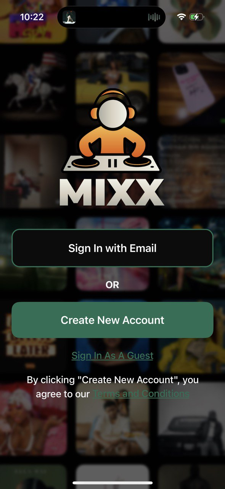
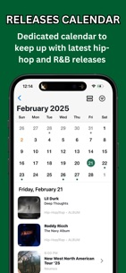
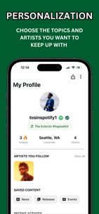
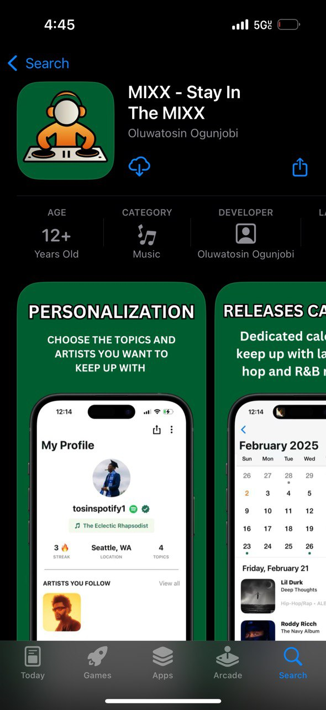

<h1 align="center">
    <div style="border-radius: 15px; overflow: hidden; display: inline-block;">
        
    </div>
    <p align="center">
        MIXX - Mobile App
    </p>
</h1>

<div align="center">


[]()


</div>

## About

MIXX is a comprehensive mobile application that delivers a personalized music discovery and cultural news experience for hip-hop and R&B enthusiasts. Powered by AI, MIXX offers intelligent music recommendations, personality analysis based on your listening habits, and seamless integration with your favorite streaming services. Discover new artists, stay updated with the latest releases, engage with community-driven content, and experience music culture like never before—all in one place.

MIXX was created by a dedicated team of four professionals: a Chief Product Designer, Marketing and Strategy Officer, Brand Manager, and myself, Tosin Ogunjobi, primary engineer/tech lead who spearheaded the development and technical architecture of the application.

## Key Features

- **AI-Powered Music Analysis**: Get personalized music personality insights generated from your listening data using advanced AI models
- **Streaming Service Integration**: Seamlessly connect with Spotify and Apple Music to sync your library and get personalized recommendations
- **Personalized Feed**: AI-curated content feed tailored to your music taste, preferences, and subscribed topics
- **Music Discovery**: Discover new artists, trending releases, and upcoming albums across hip-hop and R&B genres
- **Community Engagement**: Participate in polls, discussions, and community-driven content
- **Real-Time Updates**: Stay informed with the latest cultural news, music releases, and artist updates
- **Intelligent Recommendations**: AI-powered music recommendations based on your listening history and preferences

## Tech Stack

### Frontend & Mobile

- **React Native** (v0.76.7) - Cross-platform mobile development
- **Expo** (v52.0.36) - Development platform and tooling
- **TypeScript** (v5.3.3) - Type-safe JavaScript
- **Expo Router** (v4.0.17) - File-based routing system
- **React Native Reanimated** (v3.16.1) - High-performance animations
- **TanStack Query** (v5.51.1) - Data fetching and state management
- **React Navigation** - Navigation library for React Native

### Backend & Infrastructure

- **Next.js Server** - Backend API server
- **Railway** - Cloud hosting platform for backend services
- **Supabase** - Authentication, database, and storage
  - User authentication and session management
  - Real-time database capabilities
  - File storage for user avatars and media

### AI & Machine Learning

- **OpenAI API** - AI-powered chat features and content generation
- **Anthropic API** - Additional AI capabilities
- **Streaming SSE (Server-Sent Events)** - Real-time AI response streaming

### Music Services Integration

- **Spotify Web API** - Music library access, recommendations, and playback controls
  - OAuth 2.0 authentication flow
  - Library modification and reading capabilities
  - Playlist management
  - Top tracks and recently played data
- **Apple Music API** - Native iOS music integration
  - Apple Authentication integration
  - Music library synchronization
  - User token management
  - Playlist and library operations

### Additional Services & Integrations

- **Google Mobile Ads** - Monetization through in-app advertising
- **OneSignal** - Push notification services
- **Expo Location** - Location-based features for events and concerts
- **React Native Maps** - Interactive maps for location services
- **Expo Secure Store** - Secure credential storage
- **MMKV** - Fast key-value storage for app data

### Development Tools

- **Expo Dev Client** - Custom development builds
- **React Native Debugger** - Development debugging tools
- **TypeScript** - Static type checking
- **Jest** - Testing framework

## Technical Architecture

### API Communication

The app communicates with a Next.js backend server hosted on Railway:

```
API Endpoint: https://mixx-server-production.up.railway.app/api/v1
```

All API requests are authenticated using JWT tokens managed through Supabase authentication. The backend handles:

- User authentication and authorization
- Music personality analysis using AI
- Content feed aggregation
- Artist and release data management
- Community features (polls, discussions)
- Recommendations engine

### Data Flow

1. **Authentication**: Supabase handles user authentication (Spotify OAuth, Apple Sign-In, email)
2. **Streaming Service Integration**: Users connect Spotify or Apple Music, tokens stored securely
3. **AI Analysis**: Backend processes listening data through AI models to generate music personality
4. **Content Delivery**: Personalized feeds delivered via REST API with React Query caching
5. **Real-time Updates**: Supabase real-time subscriptions for live content updates

### State Management

- **TanStack Query**: Server state management, caching, and synchronization
- **React Context**: Global app state (Supabase sessions, user data)
- **MMKV/AsyncStorage**: Client-side persistence for preferences and cached data

### Security

- **Expo Secure Store**: Secure storage for OAuth tokens and sensitive credentials
- **JWT Authentication**: Token-based authentication with Supabase
- **Environment Variables**: API keys and secrets managed through Expo environment variables
- **HTTPS**: All API communications encrypted

## Screenshots

<div align="center">
  <table>
    <tr>
      <td align="center">
        
        <br />
        <sub>Home Feed</sub>
      </td>
      <td align="center">
        
        <br />
        <sub>Music Discovery</sub>
      </td>
      <td align="center">
        
        <br />
        <sub>Latest Releases</sub>
      </td>
    </tr>
    <tr>
      <td align="center">
        
        <br />
        <sub>AI Personalization</sub>
      </td>
      <td align="center">
        
        <br />
        <sub>App Store</sub>
      </td>
    </tr>
  </table>
</div>

---

<p align="center">Stay In The MIXX 🎵</p>